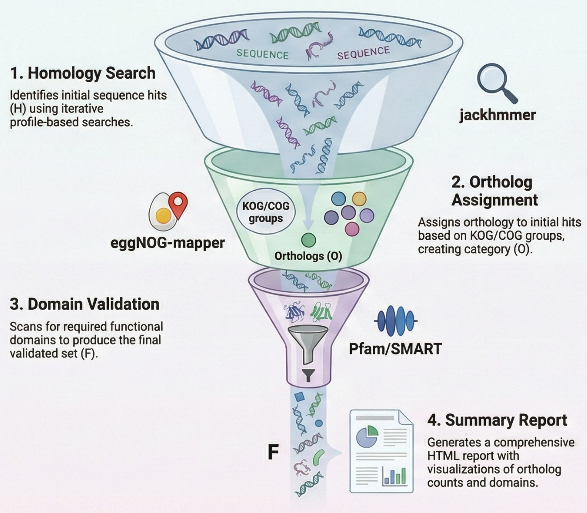

# TrueOrtho
TrueOrtho is a comprehensive Nextflow pipeline for automated ortholog identification, domain analysis, and functional annotation across multiple species. It integrates homology search, ortholog assignment, and domain conservation analysis into a single streamlined workflow.

# 📋Overview
TrueOrtho performs a multi-step analysis to identify and validate orthologous genes:

1. **Homology Search** - Identifies homologous sequences using jackhmmer
2. **Ortholog Assignment** - Assigns orthologs using eggNOG-mapper and KOG/COG annotations
3. **Domain Analysis** - Validates domain conservation using HMMER
4. **Summary Reporting** - Generates comprehensive HTML reports and statistics

# 🚀Quick Start

## Prerequisites
- Nextflow (≥ 20.07.1)
- Conda or Mamba for dependency management

## Basic Usage

````bash
nextflow run main.nf \
  --input input.csv \
  --eggnog_db /path/to/eggnog_db \
  --domain_db Pf_Sm \

````

## Input CSV Format
### Create a CSV file with the following columns:

````
query,database,kog_id,target_domain
../GS_q.fsa,../Smic.fasta,,
../GOGAT_q.fsa,../Smic.fasta,,
../GDH_q.fsa,../Smic.fasta,,
../NIR_q.fsa,../Smic.fasta,,
../NR_q.fsa,../Smic.fasta,,
../NRT_q.fsa,../Smic.fasta,,
````

### Columns:

- query: Path to query protein sequences (FASTA)
- database: Path to target species protein database (FASTA)
- kog_id: Optional KOG/COG ID for ortholog assignment
- target_domain: Optional comma-separated domain IDs for filtering

# ⚙️Parameters
## Required Parameters
- ```--input```: Input CSV file with query-database pairs
- ```--eggnog_db```: Path to eggNOG database directory

## Optional Parameters
- ```--domain_db```: Path to HMM database for domain scanning (default: downloads Pfam/SMART)

- ```--threads```: Number of CPU threads (default: 10)

# 📁Output Structure

````
results/
├── homology_search/
│   └── {query}_{species}/
│       ├── {query}_vs_{species}_hits.fa
│       └── {query}_vs_{species}_hits.list
├── ortholog_assign/
│   └── {query}_{species}/
│       ├── {query}_{species}_orthologs.fa
│       ├── {query}_{species}_hits.txt
│       └── {query}_{species}_kog_info.txt
├── domain_scan/
│   └── {query}_{species}/
│       ├── {query}_{species}_filtered_orthologs.fa
│       ├── {query}_{species}_domains.tblout
│       ├── {query}_{species}_ortholog_domains.txt
│       └── {query}_{species}_target_domains.txt
├── TrueOrtho_report.html
└── summary_counts.tsv
````

# 🔧Processes
## 1. **HOMOLOGY_SEARCH**

- **Tool**: jackhmmer
- **Input**: Query sequence + Target database
- **Output**: Homologous sequences and hit lists
- **Features**: Automatic duplicate header handling, iterative search

## 2. **ORTHOLOG_ASSIGN**

- **Tool**: eggNOG-mapper + DIAMOND
- **Input**: Homology hits + KOG information
- **Output**: Orthologous sequences with KOG annotations
- **Features**: Graceful handling of empty hits, auto KOG detection

## 3. **DOMAIN_SCAN**

- **Tool**: HMMER (hmmscan) + seqkit
- **Input**: Ortholog sequences + target domains
- **Output**: Domain-validated orthologs and domain annotations
- **Features**: Automatic Pfam/SMART database download, domain conservation filtering

## 4. GENERATE_SUMMARY_REPORT

- **Output**: Interactive HTML report with counts, sequences, and domain information




# 🧪Example Workflow

````bash
# Run with custom domains
nextflow run main.nf \
  --input input.csv \
  --eggnog_db /share/databases/eggnog_DB \
  --domain_db /path/to/custom.hmm \
  --threads 12

# Run with auto-domain detection  
nextflow run main.nf \
  --input input.csv \
  --eggnog_db /share/databases/eggnog_DB

# Resume interrupted run
nextflow run main.nf \
  --input input.csv \
  --eggnog_db /share/databases/eggnog_DB \
  -resume

````

# 🔍Features

- **Flexible Input**: Handle multiple query-database pairs via CSV
- **Robust Error Handling**: Continue processing even when individual searches fail
- **Automated Domain Detection**: Auto-detect domains from query or use predefined targets
- **Comprehensive Reporting**: HTML reports with interactive summaries
- **Resource Efficient**: Parallel processing with configurable resources
- **Graceful Degradation**: Handles empty results and missing hits gracefully

# 🛠️Technical Details

- **DSL**: Nextflow DSL2
- **Container Support**: Conda environments for all tools
- **Resume Capability**: Use -resume to continue interrupted runs
- **Resource Config**: Customizable via Nextflow configuration

# 📊Output Interpretation

- **Homology Hits**: All sequences with significant similarity to query
- **Orthologs**: Sequences sharing the same KOG/COG annotation
- **Final Orthologs**: Orthologs that pass domain conservation criteria
- **Domain Information**: Pfam/SMART domains detected in each sequence

# 🐛Troubleshooting

## Common Issues

1. **Empty hits files**: Some queries may not find homologs - this is normal for distant species
2. **EggNOG database**: Ensure the path is correct and database files exist
3. **Domain database**: Pipeline will auto-download Pfam/SMART if not provided

# 📈Performance Tips

- Use ```--threads``` to parallelize CPU-intensive steps
- Provide pre-downloaded eggNOG and HMM databases for faster execution
- Use ```-resume``` to continue from successful steps


# 📄License

This project is licensed under the MIT License - see the LICENSE file for details.

# Cite Us

If you use this software, please cite it as below:

``` commandline
```

# Acknowledgments
This work is supported through the Sequencing analysis (SequAna) core facility at the University of Konstanz [https://www.biologie.uni-konstanz.de/sequana/]

- **eggNOG-mapper**: For functional annotations
- **HMMER**: For domain detection
- **DIAMOND**: For fast sequence searches
- **Nextflow**: For workflow orchestration
  
For more information or help, please contact [abdoallah.sharaf@uni-konstanz.de].
