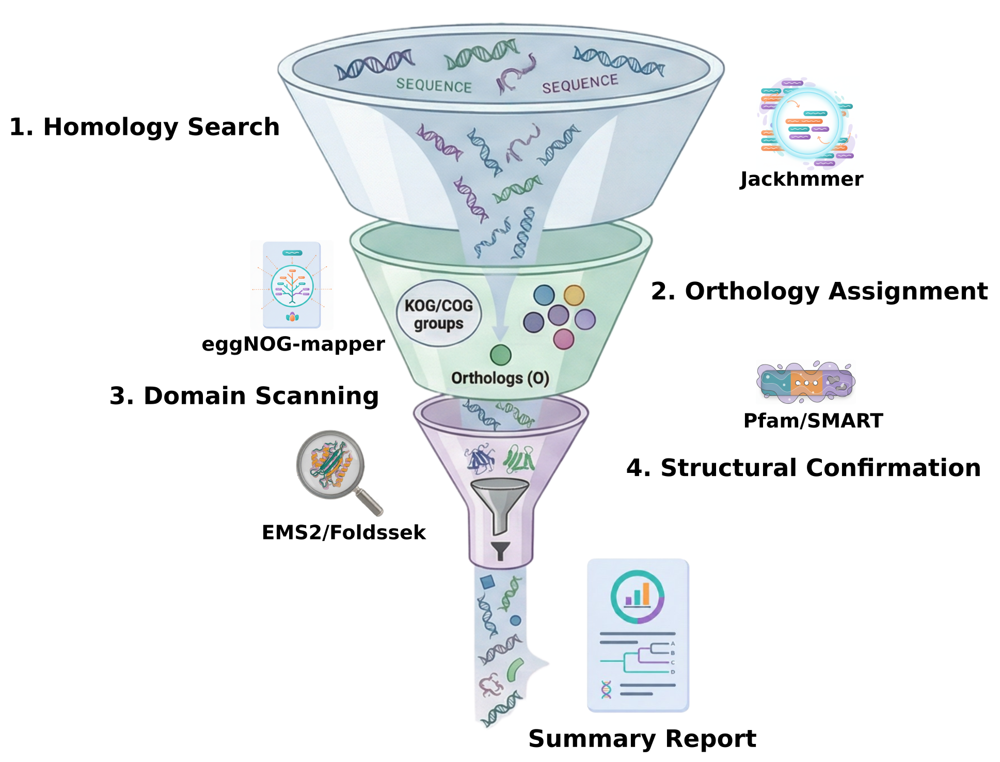

# TrueOrtho 2.0
TrueOrtho 2.0 is an expanded Nextflow pipeline for automated, structural- and embedding-aware orthology identification across multiple species. In addition to traditional sequence homology and domain architecture filtering, version 2.0 integrates deep-learning structural embeddings (ESM-2), 3D structural alignment scores (Foldseek), and automated phylogenetic trees (IQ-TREE) into a unified evidence matrix.

## What's New in Version 2.0?
Compared with TrueOrtho 1.0, this version introduces:
- Protein embedding similarity using ESM-2
- Structural similarity scoring using Foldseek
- Integrated multi-evidence confidence scoring
- Reciprocal Best Hit (RBH) verification
- Automatic phylogenetic validation of final orthologs using IQ-TREE
- Enhanced four-stage orthology filtering workflow
- Interactive HTML reports with embedded figures, evidence tables, domain annotations, and phylogenetic trees

## Workflow 




## Pipeline Stages

### 1. Homology Search
**Tool**
- HMMER (jackhmmer)
Identifies homologous proteins from the target proteome.
### 2. Ortholog Assignment
**Tools**
- eggNOG-mapper
- DIAMOND
Assigns candidate orthologs based on orthology annotations and reciprocal best-hit relationships.
### 3. Domain Conservation
**Tool**
- HMMER (hmmscan)
Validates candidate orthologs by confirming conservation of the expected Pfam/SMART domain architecture.
### 4. Embedding & Structural Analysis
**Tools**
- ESM-2
- Foldseek
Evaluates candidate orthologs using complementary structural and sequence-derived evidence, including:
- Protein embedding similarity (ESM-2)
- Structural similarity (Foldseek)
- Integrated confidence scoring
### 5. Report Generation
Generates the final evidence report by integrating all available evidence into a comprehensive summary, including:
- Confidence scores for all candidate orthologs
- Evidence matrices
- Filtering funnel statistics
- ESM-2 vs. Foldseek comparison plots
- IQ-TREE phylogenies for evolutionary validation of the final orthologs
- Interactive HTML reports
- Publication-ready tables and figures


## Prerequisites

TrueOrtho 2.0 requires the following software:

- **Nextflow** (≥ 20.07.1)
- **Docker**, or **Singularity** for dependency management

## Basic Usage

````Bash
nextflow run main.nf \
    --input input.csv \
    --eggnog_db /path/to/eggnog_db \
    --domain_db /path/to/pfam_smart.hmm \
    --prostt5_db /path/to/prostt5_db \
    --threads 12
````

## Prerequisites

TrueOrtho requires the following software:

* **Nextflow** (≥ 20.07.1)
* **Conda**, **Mamba**, **Docker**, or **Singularity** for dependency management

---

## Basic Usage

```bash
nextflow run main.nf \
    --input input.csv \
    --eggnog_db /path/to/eggnog_db \
    --domain_db /path/to/pfam_smart.hmm \
    --threads 12
```


## Input CSV Format

Create a CSV file defining one or more query–database pairs.

```csv
query,database,kog_id,target_domain
/path/to/query1.fasta,/path/to/species1_proteome.fasta,,
/path/to/query2.fasta,/path/to/species2_proteome.fasta,KOG1234,
/path/to/query3.fasta,/path/to/species3_proteome.fasta,,"Pkinase"
/path/to/query4.fasta,/path/to/species4_proteome.fasta,KOG5678,"Pkinase,WD40"

```

### Column Descriptions

| Column          | Required | Description                                                                                                                                                                         |
| --------------- | :------: | ----------------------------------------------------------------------------------------------------------------------------------------------------------------------------------- |
| `query`         |     ✓    | Path to the query protein FASTA file.                                                                                                                                               |
| `database`      |     ✓    | Path to the target species proteome FASTA file.                                                                                                                                     |
| `kog_id`        |    No    | Optional KOG/COG identifier used for explicit ortholog assignment.                                                                                                                  |
| `target_domain` |    No    | Optional comma-separated Pfam/SMART domain Short name used for domain conservation filtering. When specifying multiple domains, enclose them in quotes (e.g., `"Pkinase,WD40"`). |

---

## ⚙️ Pipeline Parameters

### Required Parameters

| Parameter | Description                                                 |
| --------- | ----------------------------------------------------------- |
| `--input` | Path to the input CSV file containing query–database pairs. |

### Database & Resource Parameters

| Parameter      | Default                                      | Description                                                                                                          |
| -------------- | -------------------------------------------- | -------------------------------------------------------------------------------------------------------------------- |
| `--eggnog_db`  | Auto-download (eggNOG v5.0.2)                | Directory containing the pre-downloaded eggNOG database.                                                             |
| `--domain_db`  | Auto-download (combined Pfam/SMART database) | Path to the HMM database used for domain scanning.                                                                   |
| `--prostt5_db` | Auto-download                                | Directory containing the Foldseek ProstT5 database used for structure prediction and structural similarity searches. |
| `--threads`    | `10`                                         | Number of CPU threads allocated for parallel execution.                                                              |
| `--outdir`     | `./results`                                  | Directory where all pipeline outputs and summary reports are written.                                                |


# Output Interpretation

The TrueOrtho workflow progressively refines candidate proteins through multiple layers of evidence:

* **Homology Hits** – All proteins with significant sequence similarity identified by **jackhmmer** or **DIAMOND**.

* **EggNOG Orthologs** – Candidate orthologs assigned using **eggNOG** annotations, **KOG/COG** information, and **Reciprocal Best Hits (RBH)**.

* **Domain-Screened Orthologs** – Candidate orthologs that retain the expected **Pfam/SMART** domain architecture after HMMER validation.

* **Final Structural Orthologs** – Domain-validated orthologs further evaluated using **protein embedding similarity (ESM-2)**, **structural similarity (Foldseek)**, and an integrated confidence score. These represent the highest-confidence ortholog predictions.

* **Confidence Score** – A composite score integrating reciprocal best-hit support, protein embedding similarity, structural similarity, and domain conservation to prioritize candidate orthologs.

* **Classification** – Each final ortholog is assigned to one of the following confidence categories:

  * **`PRIMARY_TRUE_ORTHOLOG`** – A high-confidence one-to-one ortholog supported by multiple independent lines of evidence, including reciprocal best hits, strong embedding similarity, high structural similarity, and conserved domain architecture. These represent the most reliable ortholog predictions.
  * **`SECONDARY_TRUE_ORTHOLOG`** – A likely ortholog supported by most evidence sources but with weaker overall support than a primary ortholog (e.g., lower structural similarity, weaker RBH support, or a reduced confidence score). These remain strong candidates but should be interpreted with slightly greater caution.
  * **`CO_ORTHOLOG`** – An additional ortholog arising from a lineage-specific gene duplication event. Multiple co-orthologs may correspond to a single query protein while retaining substantial sequence, structural, and functional similarity.

* **Phylogenetic Validation** – IQ-TREE phylogenies are generated for the final ortholog set and included in the interactive HTML report as supporting evolutionary evidence. These trees are intended for **validation and visualization only** and are **not** used for ortholog inference or candidate filtering.


💡 Key Features & Tips

Nextflow DSL2 Support: Fully modular process design built for scalability.Resume Capability: Run with -resume to restart from interrupted steps without recalculating complete stages.Performance Optimization: Provide local paths for --eggnog_db and --domain_db to bypass download overhead on large clusters.


📜 Citation & LicenseLicense

This pipeline is open-source and released under the MIT License. Third-party dependencies maintain their respective open-source licenses (located under /third_party_licenses/).

Citation

If you use TrueOrtho in your research, please cite:Sharaf, A., & Voolstra, C. R. (2025). SequAna-Ukon/TrueOrtho (Version 2.0.0). Zenodo. https://doi.org/10.5281/zenodo.17867442Acknowledgments & SupportSupported by the Sequencing Analysis (SequAna) Core Facility at the University of Konstanz (biologie.uni-konstanz.de/sequana).

For inquiries, issues, or feature requests, contact abdoallah.sharaf@uni-konstanz.de.
